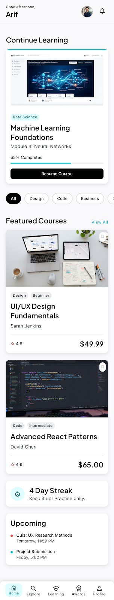
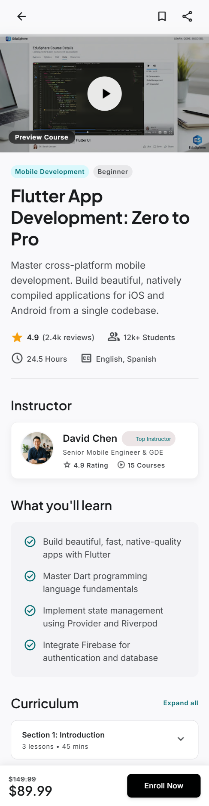
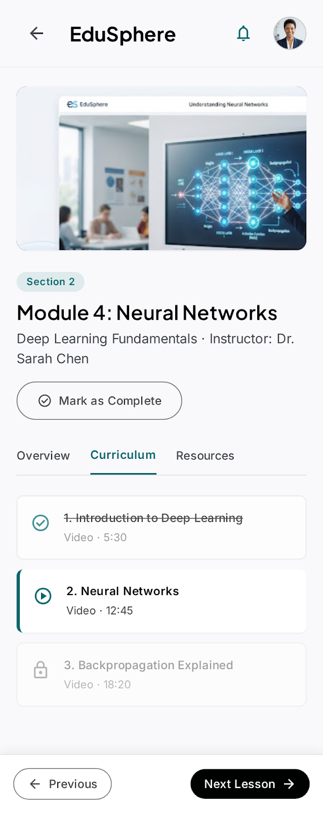
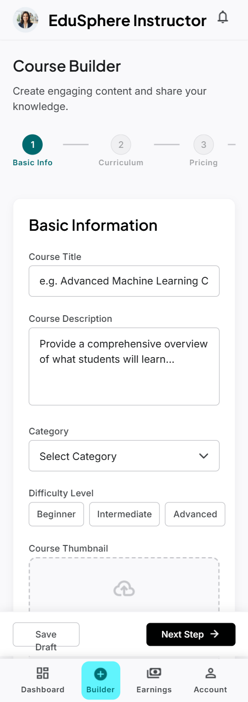
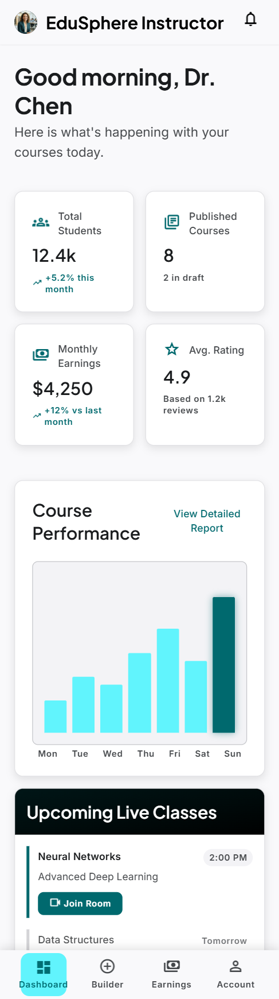
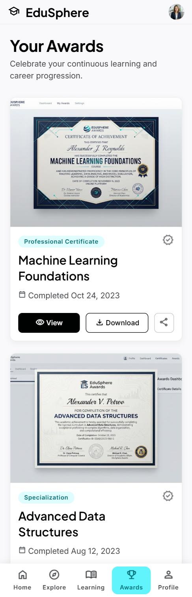
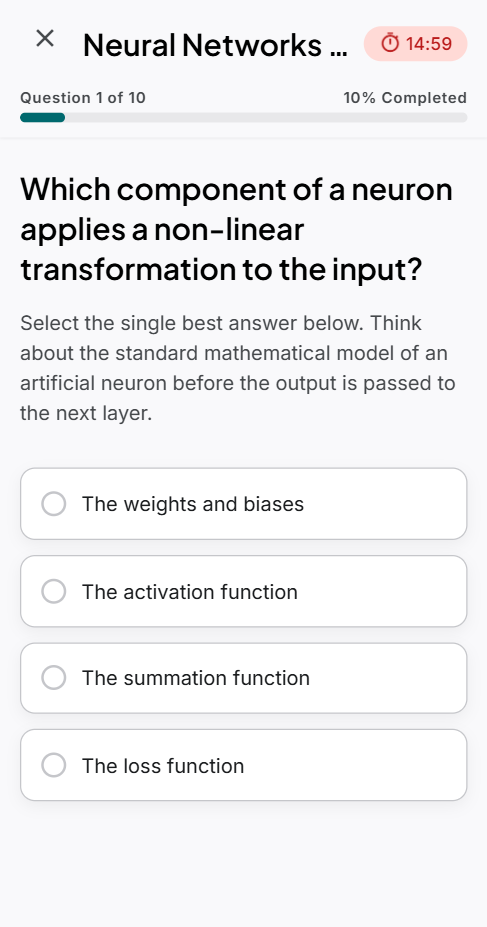
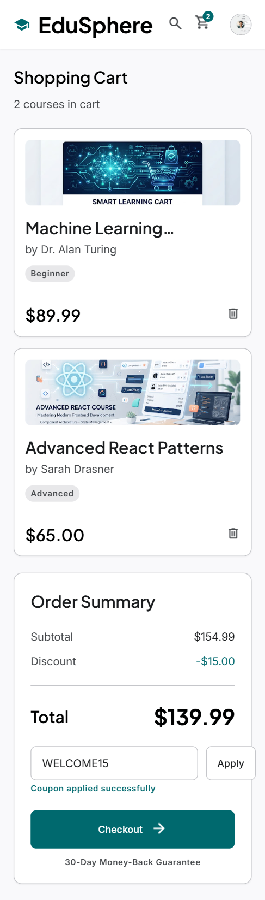
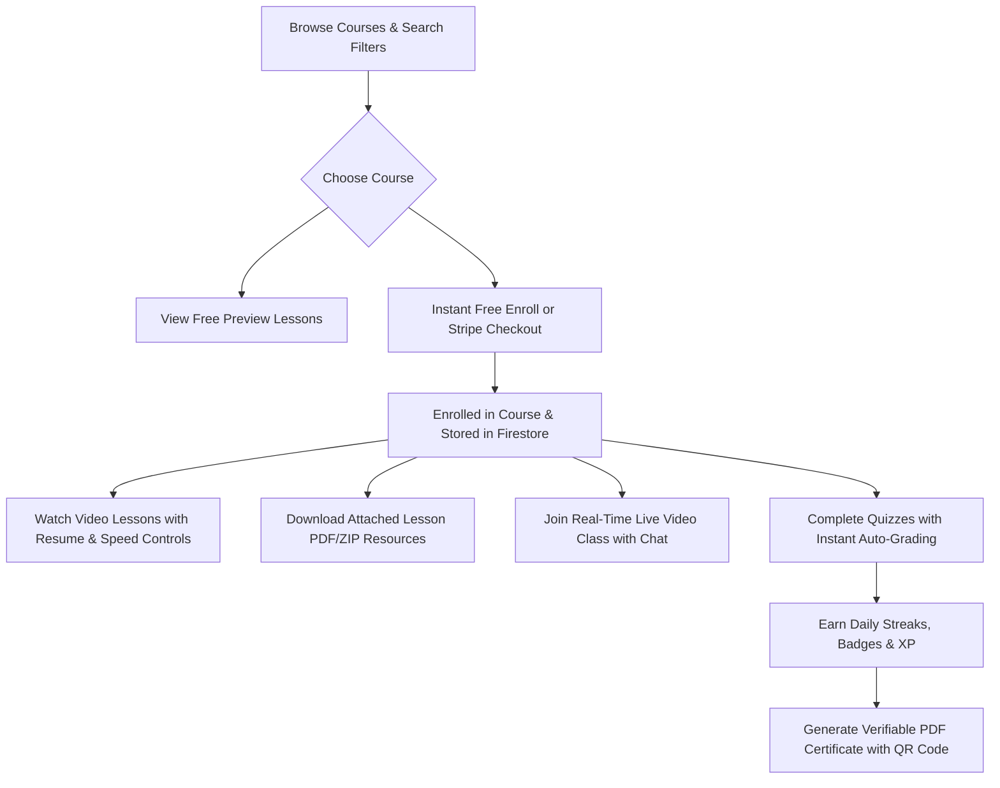
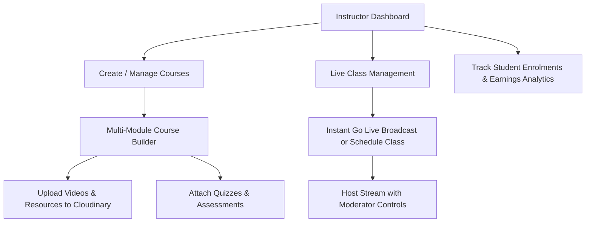

# 🎓 EduSphere — Next-Generation E-Learning Platform

<div align="center">



**A full-stack, multi-role e-learning and live interactive broadcast ecosystem built with Flutter, Riverpod, Firebase, Cloudinary, Cloudflare Workers, and Jitsi/8x8.**

[](https://flutter.dev)
[](https://dart.dev)
[](https://riverpod.dev)
[](https://firebase.google.com)
[](https://workers.cloudflare.com)
[](https://cloudinary.com)
[](https://jaas.8x8.vc)
[](LICENSE)

</div>

---

## 🌟 Overview

**EduSphere** is an enterprise-grade learning management and real-time interactive broadcast application designed for **Students** and **Instructors**. Built from the ground up on a single responsive codebase targeting **Android, iOS, Web, and Desktop**, EduSphere blends rich multimedia course consumption with real-time video classrooms, instant assessments, gamified progress tracking, and verifiable credential issuance.

### 🛡️ Zero-Billing Card Architecture
EduSphere is engineered around a strict **100% Card-Free Architecture**, ensuring full-stack production capabilities across all services without requiring linked credit cards:
- **Database & Auth:** Firebase Firestore + Firebase Auth (Free Spark Tier).
- **Video & Asset Storage:** Cloudinary Free Tier (Signed authenticated streaming + public preview presets).
- **Serverless Compute & Secret Handling:** Cloudflare Workers (100,000 requests/day free tier) for token generation, signed video URLs, and certificate generation.
- **Live Classroom Infrastructure:** 8x8 JaaS (Jitsi-as-a-Service) with RS256 cryptographically signed JWT authorization.

---

## 📸 App Interface Preview

<div align="center">

| 🏠 Home & Course Discovery | 📖 Course Details & Curriculum | 🎬 Video Player & Resources |
| :---: | :---: | :---: |
|  |  |  |

| 🔴 Real-Time Live Class (Jitsi) | 🛠️ Visual Course Builder | 📊 Instructor Dashboard |
| :---: | :---: | :---: |
|  |  |  |

| 🏆 Gamification & Awards | 📝 Interactive Quizzes | 💳 Shopping Cart & Checkout |
| :---: | :---: | :---: |
|  |  |  |

</div>

---

## 🔄 How EduSphere Works (App Workflow)

EduSphere provides seamless, dedicated experiences tailored to each user role:

### 1. 🎓 The Student Workflow


1. **Course Discovery & Filtering:** Explore courses by categories, level, rating, price range, duration, and keyword search with real-time responsive grid/list switching.
2. **Seamless Enrollment:** Instant 1-click enrollment for free/community courses, or secure test-mode Stripe checkout for premium offerings.
3. **Adaptive Video Learning:** Resume playback from where you left off, toggle playback speeds (0.5x to 2.0x), enable subtitles, and download exclusive supplementary lesson materials.
4. **Interactive Live Classrooms:** Join HD two-way interactive video sessions powered by 8x8 JaaS with live participant lists, real-time messaging, and hand-raising.
5. **Knowledge Testing:** Take timed MCQ and true/false assessments with instant grading, detailed explanations, and review breakdown.
6. **Gamification & Verifiable Credentials:** Level up with XP points, unlock milestone badges, maintain daily study streaks, and download cryptographically verifiable PDF certificates.

---

### 2. 👨‍🏫 The Instructor Workflow


1. **Centralized Command Center:** View total enrolled students, active courses, aggregate student ratings, and revenue charts.
2. **Visual Course Builder:** Create multi-module curricula, upload high-definition video lessons directly to Cloudinary, attach downloadable raw resources (PDF/ZIP), and set free preview locks.
3. **Assessment Creator:** Build interactive quizzes directly within the curriculum editor with configurable pass marks, time limits, and custom explanations.
4. **Live Class Management:** Schedule upcoming webinars or click **"🔴 Go Live Now"** to launch an instant broadcast session with moderator privileges and FCM push alert dispatch.
5. **Earnings & Analytics:** Real-time financial insights, transaction histories, and course performance analytics.

---

## 🏗️ Architecture & Technology Stack

| Layer | Technology | Details |
| :--- | :--- | :--- |
| **Frontend UI** | **Flutter 3.x / Dart** | Single responsive codebase for Android, iOS, Web, and Desktop |
| **State Management** | **Riverpod 2.6** | Clean unidirectional data flow and reactive provider boundaries |
| **Routing** | **GoRouter** | Declarative deep-linking and role-guarded route protection |
| **Database & Auth** | **Firebase Firestore & Auth** | Real-time documents, Google Sign-In, Email/Password authentication |
| **Media Storage** | **Cloudinary** | Signed video streaming for paid lessons, raw resources, and certificates |
| **Serverless Workers** | **Cloudflare Workers** | Edge compute for signed URLs, JaaS JWT tokens, and certificate verification |
| **Live Video Class** | **Jitsi Meet SDK / 8x8 JaaS** | Low-latency WebRTC interactive multi-party video conferencing |
| **Push Notifications**| **Firebase Cloud Messaging** | Background and foreground live session reminders |
| **Payments** | **Stripe (Test Mode)** | Secure payment processing and automatic enrollment fulfillment |

---

## 🔐 Secure Serverless Edge Services

EduSphere uses Cloudflare Workers as its serverless backend tier to protect all private keys and secrets:

- [`getVideoStreamUrl`](backend/workers/getVideoStreamUrl): Verifies Firestore student course enrollment before generating a short-lived, signed Cloudinary video delivery URL.
- [`getLiveClassToken`](backend/workers/getLiveClassToken): Generates RS256 cryptographically signed JWT tokens for JaaS/8x8 live classrooms with moderator role verification.
- [`generateCertificate`](backend/workers/generateCertificate): Builds tamper-proof PDF completion certificates with unique verification IDs and scannable QR codes.
- [`verifyCertificate`](backend/workers/verifyCertificate): Public verification endpoint allowing employers and third parties to validate issued certificates.
- [`stripeWebhook`](backend/workers/stripeWebhook): Handles payment confirmations and writes student enrollment records directly to Firestore.

---

## 📂 Project Structure

```
Edusphere/
├── android/                      # Native Android platform configuration & permissions
├── backend/                      # Cloudflare Workers serverless edge backend
│   └── workers/
│       ├── generateCertificate/  # PDF certificate builder with QR code
│       ├── getLiveClassToken/    # JaaS 8x8 RS256 JWT token generation
│       ├── getVideoStreamUrl/    # Signed Cloudinary video delivery
│       ├── stripeWebhook/        # Stripe payment confirmation handler
│       └── verifyCertificate/    # Public certificate verification
├── ios/                          # Native iOS configuration
├── lib/
│   ├── assets/                   # Static mock data, seed JSON, and icons
│   ├── components/               # Reusable atomic UI component library
│   │   ├── AppBar.dart           # Responsive navigation top bar
│   │   ├── CourseCard.dart       # High-density course card with discount tags
│   │   ├── LiveClassRoom.dart    # HD live video feed, attendee list & controls
│   │   ├── VideoPlayer.dart      # Custom player with speed & subtitle controls
│   │   ├── QuizWidget.dart       # Question renderer with immediate feedback
│   │   ├── jitsi_embed_mobile.dart # Native Android/iOS Jitsi Meet integration
│   │   └── ...
│   ├── models/                   # Immutable Dart data models
│   │   ├── course_model.dart     # Course, Module, Lesson, Resource models
│   │   ├── user_model.dart       # User, Roles, XP, Streaks, Badges
│   │   ├── live_class_model.dart # Live class status & attendees
│   │   └── ...
│   ├── providers/                # Riverpod reactive state providers
│   ├── screens/                  # Feature screens (Student & Instructor modes)
│   ├── services/                 # Domain business services (Auth, Video, Live, Quiz)
│   ├── styles/                   # Design system tokens (Colors, Typography, Spacing)
│   └── utils/                    # Route guards, constants, and formatting helpers
├── stitch/                       # Pixel-accurate UI design exports & reference screens
├── test/                         # Comprehensive automated test suite (69 test suites)
└── pubspec.yaml                  # Flutter package dependencies
```

---

## 🚀 Getting Started

### Prerequisites
- **Flutter SDK:** Version `3.22.0` or later ([Install Guide](https://docs.flutter.dev/get-started/install))
- **Node.js:** Version `18+` (for serverless workers)
- **Wrangler CLI:** `npm install -g wrangler`

### 1. Clone the Repository
```bash
git clone https://github.com/your-username/edusphere.git
cd edusphere
```

### 2. Install Dependencies
```bash
# Install Flutter packages
flutter pub get

# Install Cloudflare Worker dependencies
cd backend/workers/getLiveClassToken
npm install
cd ../../..
```

### 3. Run the Flutter App
```bash
# Run on connected Android or iOS device
flutter run

# Run on Web (Chrome)
flutter run -d chrome

# Run on Windows Desktop
flutter run -d windows
```

### 4. Deploying Serverless Workers (Optional)
```bash
# Set Cloudflare secrets for live video tokens
cd backend/workers/getLiveClassToken
wrangler secret put JAAS_PRIVATE_KEY
wrangler secret put JAAS_API_KEY_ID

# Deploy to Cloudflare edge network
npx wrangler deploy
```

---

## 🧪 Testing

EduSphere features a comprehensive automated test suite covering state management, authentication guards, payment workflows, video streams, responsive breakpoints, and live classrooms:

```bash
# Run the full automated test suite
flutter test

# Run static analysis
flutter analyze lib
```

---

## 📄 License

This project is licensed under the **MIT License** — see the [LICENSE](LICENSE) file for details.

<div align="center">
  <sub>Built with ❤️ for learners and educators worldwide.</sub>
</div>
